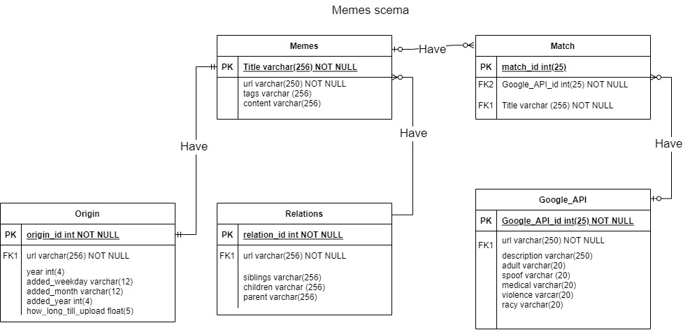
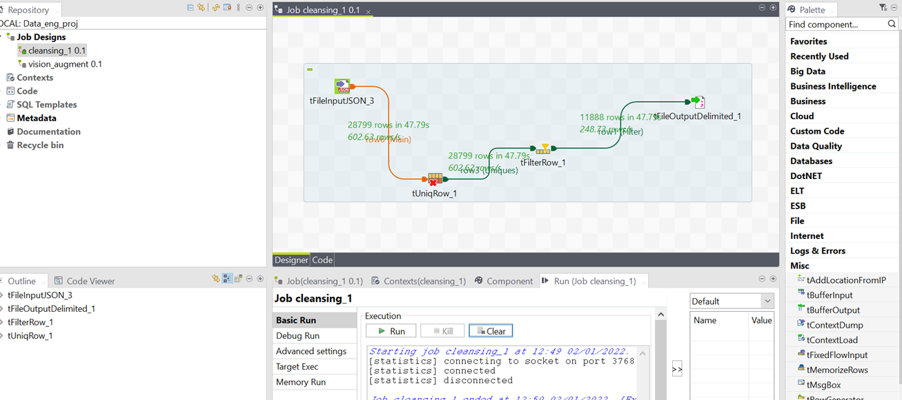
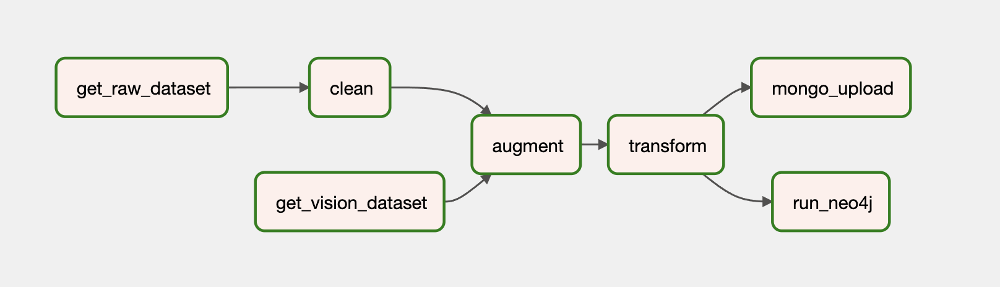
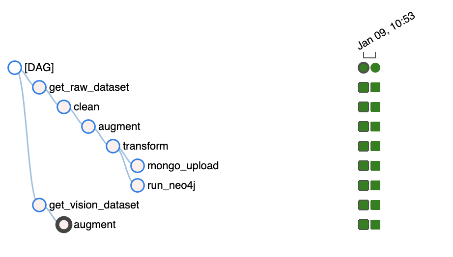
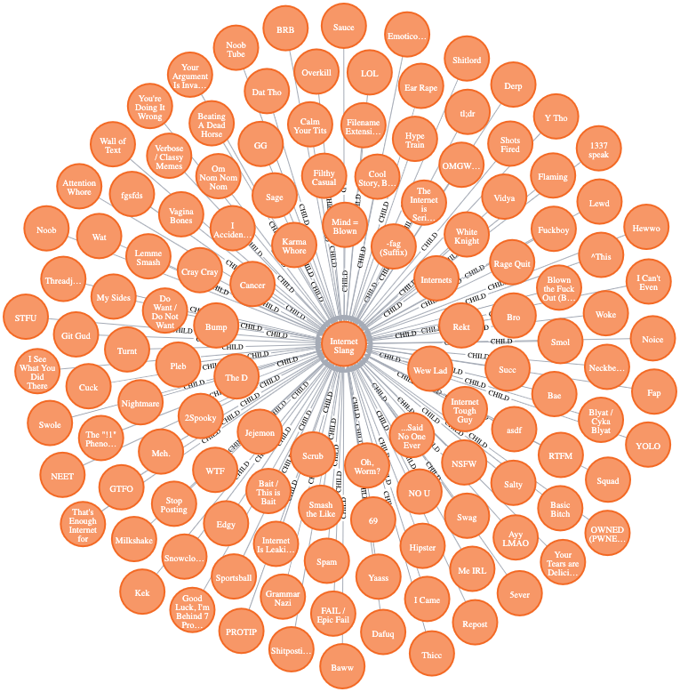
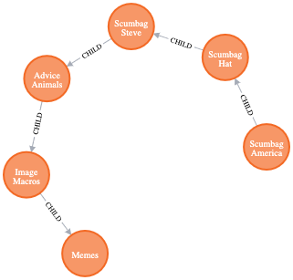

# LTAT.02.007 Data Engineering project report - G12

[Link](https://github.com/martmagi/data-engineering) to our GitHub repository.

Project members:
* Kaja Jakobson
* Rasmus Bobkov
* Mart Mägi
* Roland Pajuleht

## Our proposed taskplan:
Idea was to make a minimalistic ER schema. Keep all the atomic attributes in respective entities and keep all the cardinalities under control. Meaning that there wouldn't exist M to N pairs.

1. Data cleansing:
    1. Keep only confirmed memes (specified under details)
    2. Remove duplicates if any (based on title + URL)
    3. Remove fields except:
        1. title,  added, template_image_url, tags, details, (meta[description] for the last mentioned Query if we can do it)
2. Data augmentation/enrichment:
   1. Create new schema
   2. Assign unique IDs 
   3. Download template image and send it to google vision API, and store
3. Data transformations:
   1. Datetime transformations to get day, month, year and possibly season. 
   2. Transformations on data based on google vision output. 
   3. Location aggregation based on region (Europe, Asia, online etc.)
   4. Convert to Neo4j acceptable input. 
   5. Make ER schema for SQL DB.
4. Analysis:
   1. Show the number of the memes per year in descending order.  (SQL)
   2. Which memes have the largest number of common tags? 
   3. All memes containing tag Estonia.  Sort by year. 
   4. Rank memes by origin (youtube, 4chan, fb etc) (content->origin->links)
   5. Something to Query about semantic relations of memes. (if you could help us with this it would be great)

We worked out a plan. On the first step, which is data cleaning, we drop the fields which we believe are not necessary for us, so that we can decrease the computational load due to memory footprint and calculations and so on. With the second step, data augmentation/enrichment, we chose to use google vision API response on our url. On the third step, data transformations, the idea was to get more meaningful information from the raw data and finally with the analysis step to run some queries, such as the most popular day for the meme upload or region specific memes and so on. 

## Our proposed ER schema:

## Unsuccessful attempts:

Since the coding background for Rasmus, Kaja and Roland was minimal to say the least, this project seemed rather overwhelming in the beginning. Luckily from a database course, which Rasmus was taking in parallel, he was introduced to this tool called talend. It seemed like a user-friendly ETL tool designed specifically for us in mind. An environment where you can simply drag and drop boxes and on the background some Java code does all the heavy lifting for you. After working for many hours on reading up on how to import json and some different working mechanics on boxes and how to connect them and so forth, we got the first pipeline working, everything seemed to go as planned.
However when we wanted to integrate it with the airflow, making a JAR runnable file out of the talend job used, our efforts were in vain. The integration did not work because of the t.jsoninput component used in talend job was not supported by airflow. Below is a screenshot from the first pipeline done with talend.

## Pipeline overview
Overall structure of the pipelines as it can be seen in the Airflow UI. Starting with two parallel branches to pull both datasets and ending again with parallel branches to upload to MongoDB and Neo4J databases. 

|                 Graph view                 |                Tree View                 |
|:------------------------------------------:|:----------------------------------------:|
|  |  |

### Creating the DAG

[Link](./dags/dags.py) to code that shows Airflow DAG creation and task control flow.

### Pulling the datasets (parallel)

The first pipeline steps download the necessary data files. For our pipelines we needed 2 different files. First is the previously mentioned raw data file `kym.json` and also `kym_vision.json` file, the Google Vision API file, which has already been put together on the dataset.

[Link](./dags/download_datasets.py) to code that downloads both the original KnowYourMeme dataset and Google Vision dataset from the course's provided sources.

### Cleaning step

For the cleaning step, we read in the file as a [Pandas DataFrame](https://pandas.pydata.org/docs/reference/api/pandas.DataFrame.html). First thing, we decided to get the data we wanted out of a dictionary field, details. Then we created new columns for status, origin and year and looped them in. next we dropped unwanted columns, duplicates based on title and url. After that the  decision was to keep only confirmed memes in our dataset. The necessary criteria for that decision was specified in status column. Last step was to write out the json file and that’s all done with the cleaning.

[Link](./dags/cleaning.py) to code that runs cleaning steps using [pdpipe library](https://github.com/pdpipe/pdpipe).  

### Augmentation step

Now the output of the previous cleaning step is piped to augmentation step. Luckily for us we already had the necessary Google Vision API responses in a file set up. So the task in that regard was more as a data transformation step for us. So first thing to do was to read in both the downloaded file as a dataframe `df_vision` and cleaned file as df, then get the set difference for all the values between two dataframes based on url overlap. That list was used to drop all the unnecessary records in the `df_vision`. Then new columns were created for the attributes we wanted to extract from the vision dataframe.
Next we looped through every url in the cleaning output and extracted the wanted fields where we had url match between the dataframes. Here we wanted to get all the API responses for the type of content, regarding its classification as of belonging in the adult, spoof, medical, violence or racism categories.
The problem with description attribute from the `vision_dataframe` was that it was in a list as bunch of items. Since there didn't seem to be any already built-in method to insert a list into a dataframe cell, a new list with the length of the original dataframe was made. Every url in the original dataframe was looped through and based on url match, up to 10 most popular API responses for the meme description were extracted and written under respective index in the created list. The final step was to insert that newly created and filled list to original dataframe under  column named - `google_api_description`, and save it all out as json again.

[Link](./dags/augmentation.py) to code that augments the cleaned data with metadata acquired from Google Vision dataset.

### Transformation step

The next stage in the pipeline was the transformations. These ones we decided to keep pretty basic, since we didn't see really what else we could transform here, since the numeric content of the data was pretty restricted and more sophisticated NLP is over our heads at this point in time. So we had 2 numeric fields we could work with. The first one was the UNIX timestamp from the time the meme was imported to the knowyourmeme database. So we extracted the human readable datetime from that timestamp. From that datetime we extracted day, month and year. And on top of that we calculated a new value - `how_long_till_upload`, which gives us the time window in years since the time of meme creation and upload to knowyourmeme database. It works for old memes, but since the origin is given simply as a year for us, then with newer memes its most likely going to be just 0. These newly transformed fields however help us with various meaningful queries.

[Link](./dags/transformation.py) to code that transforms some of the existing data fields to facilitate more convenient querying.

### Database import (parallel, MongoDB and Neo4J)
But before that step, one actually needs something to query upon.
So as for our fifth dag we chose to import it to MongoDB using [PyMongo](https://pymongo.readthedocs.io/en/stable/).
We chose to use mongoDB, since it was introduced to us in a course practice session and this particular session sympathized to us. MongoDB seemed like a perfect fit for nebwies like us.

[Link](./dags/mongo_upload.py) to code that uploads the data to MongoDB web database (we used [MongoDB Atlas](https://www.mongodb.com/atlas/database) for convenience and to test out HTTP upload)

[Link](./dags/neo4j_import.py) to code that imports the data to a Neo4J database running in local Docker container.

## Neo4J queries

`MATCH (child)-[r:CHILD]->(parent) RETURN parent, COLLECT(child) as childs ORDER BY SIZE(childs) desc  limit 1`

`MATCH p=(start:Meme)-[:CHILD*1..10]->(end:Meme) RETURN p ORDER BY length(p) DESC LIMIT 1`

## MongoDB queries
Here various queries working on our imported data can be seen. For example: how many confirmed memes are created every year? Based on the query response we can see those numbers for the years 2008…2011, since we have limited the response to 5 items in total.

and the response

Originally we wanted to query if there are any memes about Estonia, but sadly, there were not. So how about our neighbours over the Baltic sea. To our surprise there was only one meme about Finland, which is called Apu apustaja.

and the response 

Here are the top 5 tags, which are the most common as over all the memes in our dataset.

and the response

Top 5 places where most of the memes originate from.

and the response

And now using some field generated through our data transformation, here are the 6 most meme heavy months.

and the response 

## Contributions of members to the project

In large the project was done as a group effort with us having regularly scheduled workout times, so that we booked a time and worked throughout those ours over the zoom.
Even as such, the tasks completed per person were roughly as follows:

* Mart - did most of the heavy coding required with airflow integrations and to get it properly running.
* Roland - Worked on Talend and ER-schema
* Kaja - Worked on Queries, Talend, ER-schema and project management
* Rasmus - Worked out pipelines, presentation and project management
